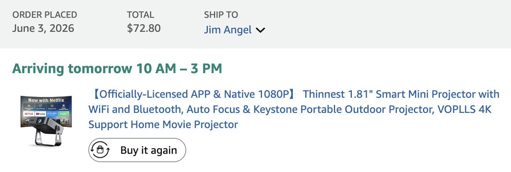
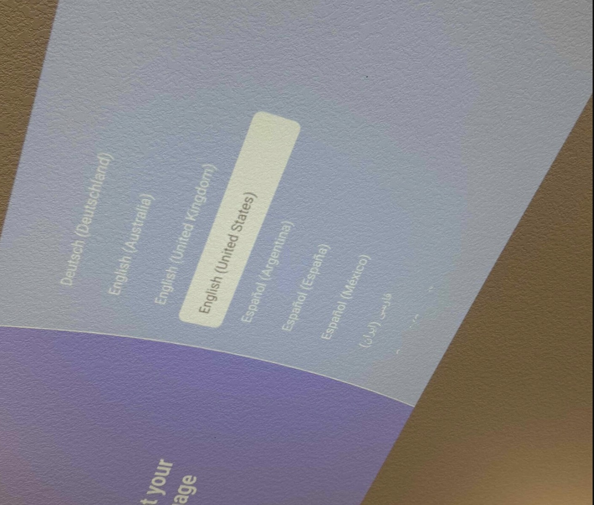
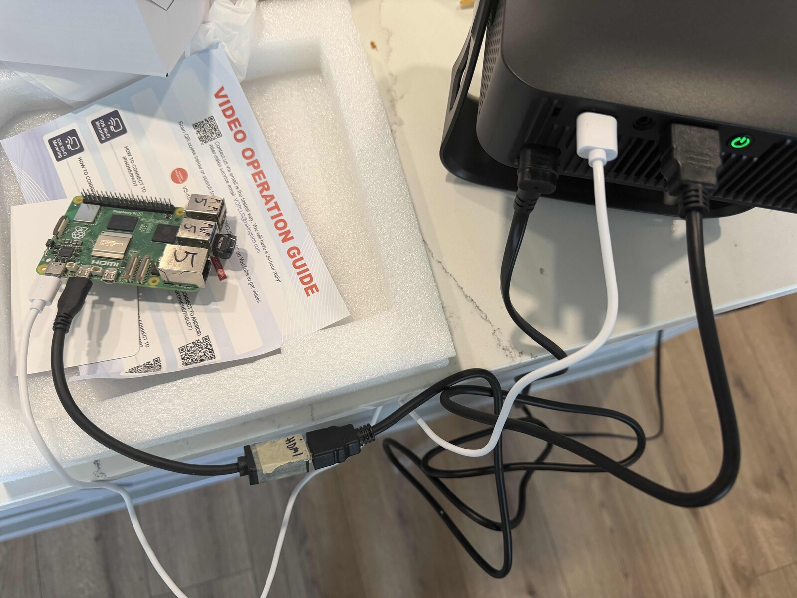
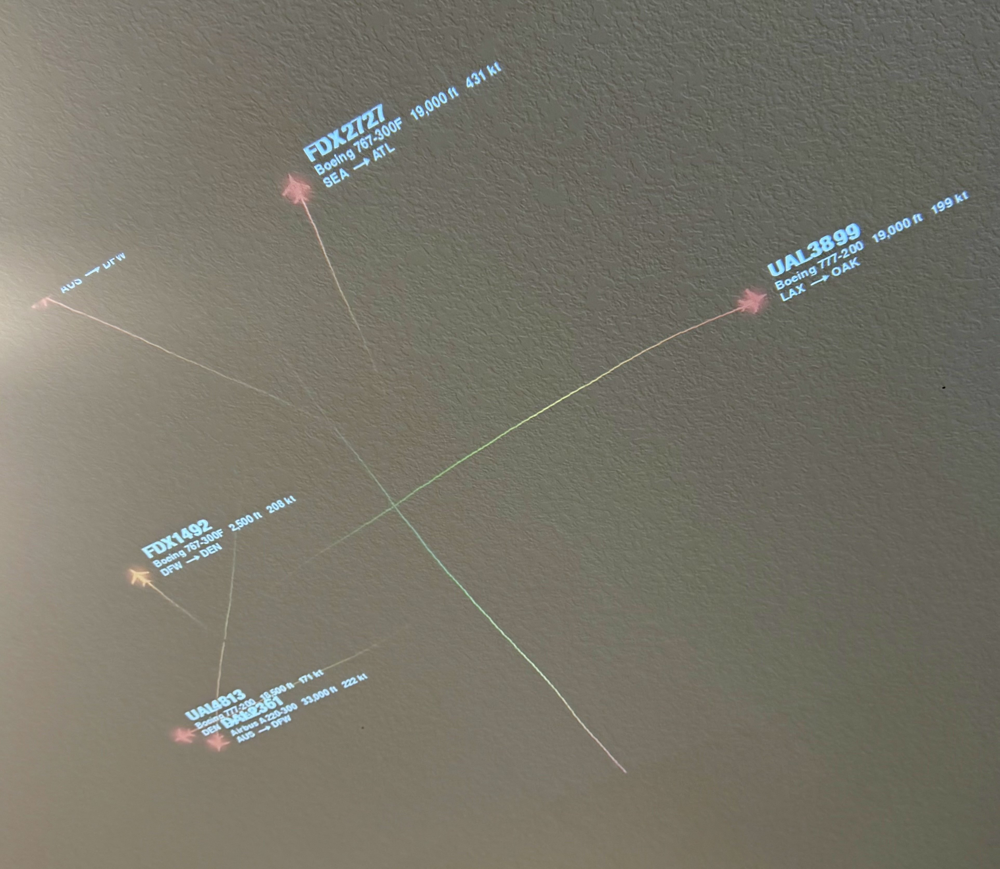
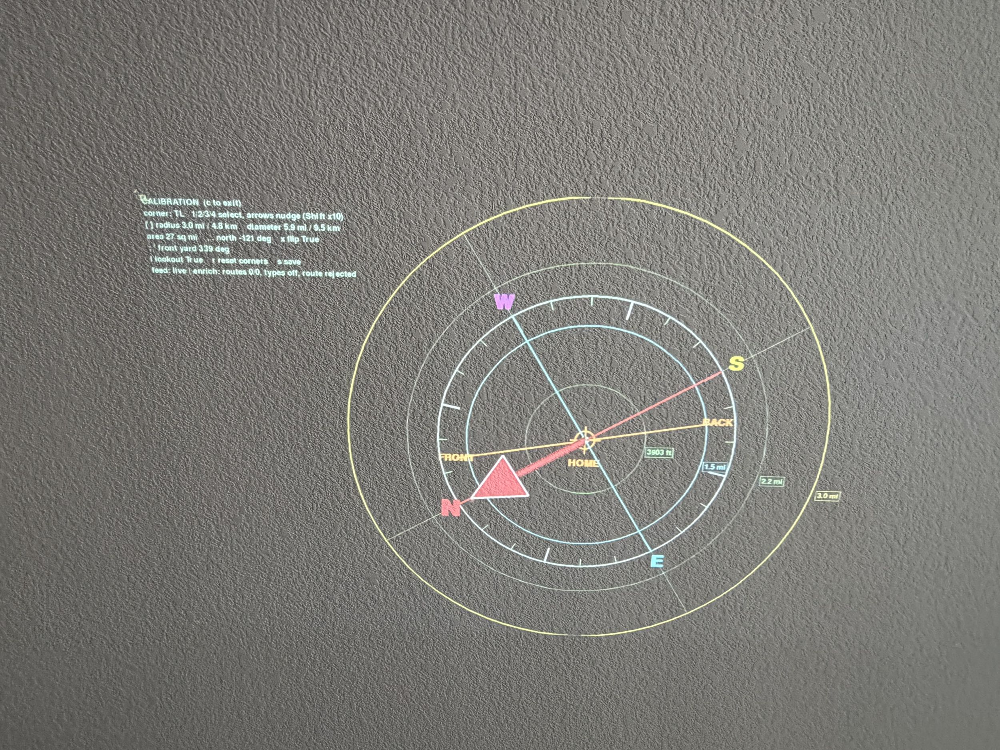


I'm an idiot — the original poster does have a GitHub, but wasn't allowed to post it because of Reddit rules: [cpaczek/skylight](https://github.com/cpaczek/skylight). Thanks for the inspiration and a fun couple-hour project!


## Background

A couple days ago my mom sent me [this](https://www.reddit.com/r/aviation/comments/1tvabpy/i_live_in_the_take_off_path_of_sfo_and_built_a/) Reddit post in [r/Aviation](https://www.reddit.com/r/aviation/) where someone was projecting live planes overhead onto their ceiling in real time.

I thought it looked super cool, and so did the rest of the comments! The only problem: **I couldn't find any source code to play with!**

I have almost everything needed to do this, except a projector. I figured it should be easy enough to vibe code.

Which I fixed for $72 ($99 before some credits):

I didn't want to spend a ton of time on this, so I set a goal: **Only allow 4 hours to get it working, or bail on the idea.**

Just want the code? TLDR: [github.com/jimangel/Ceiling-Radar](https://github.com/jimangel/Ceiling-Radar).

## Why 2 Pis?

I used 2 Pis because one was already set up and I had an extra. 

This setup could be combined and/or use an online ADS-B service like [ADS-B Exchange](https://www.adsbexchange.com/).

Building your own [ADS-B receiver](https://www.flightradar24.com/build-your-own) is simple (the antenna was ~$40), and if you share your data back to flight providers, a lot of times they'll give you a "free" premium subscription!

## Get a working projector

The projector came fast and was surprisingly bright!

Another bonus was that the projector's USB port could also power the Raspberry Pi! I had to skip the low-power settings warning on boot.


The projector tries REALLY hard to force you to use an app / Wi-Fi. I avoided this with the remote and clicking around; once things were working, it hasn't prompted me again (but I also don't use it for anything else).


## My approach to AI

Since I'm vibe coding this, I figured it'd be neat to outline the basic process.

### Plan first

Whether I'm in the CLI or UI, I find I have good success starting with planning before execution. Even more so with squishy ideas.

This is a self-contained app that I have no history or files of, so I'll plan in a UI and have it generate the first MVP demo code to use, and I'll use the CLI once I start testing.

First I prompted it to create a plan / general MVP. Here's the actual prompt:

> Write a plan for how to link my ads b json feed to recreate this on a projector. Also hope could I generate this projection on a raspberry pi to project on a ceiling like the picture and move (specifically mapping a ceiling projection so a plane could follow across ceiling and be tuned to perfection for location / map skew easy

Usually I refine things from here, such as:

- Giving more specific local IP data
- Asking how to handle data enrichment (online)
- Asking to include things to look more like the demo I saw
- Asking to create demo data so I can test if the app works before testing if the full data path works

At the end I had a "should-be-working" demo!

This is around when I started writing this blog (meta!).

**Time check:** 1h

### Switch to agentic harness

Agentic harnesses are the Claude Code, Codex, Antigravity, OpenCodes, and Pi's of the world. They all essentially wrap AI calls around tools and CLI actions.

This allows me to let the LLM make code changes / test and more control.

I jumped into my terminal, found the downloaded demo, and asked the LLM-of-the-week to copy it to a Pi and run it.

### Using demo data to preview

Right away I was impressed! It "just worked." I was able to follow the README and see planes on my ceiling!

**Time check:** 1h 30m

### Using live data

Next I needed to replace the demo data with my local ADS-B data, which was a matter of following the README and — again — things just worked.

### Config tweaks

This is where I spent most of my time, and I was learning as I went. The app allowed for dynamic configuration: if you press the "c" key, you can use keyboard keys to adjust the compass layout.

The first problem was: Where is north? So I added a big red indicator for adjusting.

**Time check:** 2h 45m

I continued making minor quality of life adjustments. I think the coolest one was having the trail / plane color go from red to green the closer it was to your house (since you can't see center).

Here's what the config resulted in:


Check out the [GitHub repo](https://github.com/jimangel/Ceiling-Radar) for the full code and setup details!


## It worked! 🎉

After ~3.5h of work, we have a solid demo! Although I'll end up spending more time writing this blog 😅

## Write about it and make diagrams

I generated a Mermaid diagram but was unhappy with it, and drew the image at the top of this blog instead.

Lastly, I had to push the GitHub code and this blog post!

## From here?

It wasn't until I was done, and writing this, that I found the code already exists. That took the wind out of my sails to continue improving this.

Oh well, it was a fun side-project! Feel free to ask your favorite LLM to make changes!

I was thinking it'd be neat to have Home Assistant control when the projector turns on, so it's only running when there's a plane nearby. For another weekend...